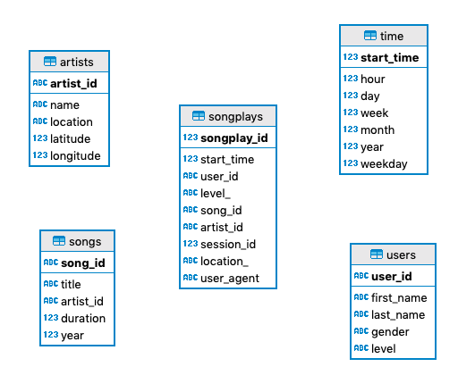

# Sparkify DB Migration Project

This project migrates the Sparkify data from JSON log files to a Postgresql schema.   

## Database Purpose

Sparkify decided to move their data from log files to a relational database because they needed to improve their ability 
to query their data in a standard way (SQL). Among their goals are:

- Ability to do aggregations (E.g: Determine users usage behavior, gender play records, artist popularity, among others)
- Query flexibility (As a startup they want to explore their data with as much flexibility as possible)
- Ability to add secondary indexes (They want to speed up their queries on different fields)

## Database Schema



The database schema was designed to according based on the JSON log files to be migrated.    

The `songplays` table is the _fact table_ of the schema. This table contains all the information of the users 
reproductions. It's also denormalized because it contains the subscription level of the user (`free/paid`) and the 
location in the same table. This allows having faster queries.   

The ETL pipeline populates the dimension tables (`artists`, `time`, `songs`, `users`) first and then moves 
to the fact table (`songplays`).

## Example Queries

Users by gender:    

```sql
select u.gender, count(1)
from users u
group by u.gender;

```

Reproductions by gender:

```sql
select u.gender, count(1)
from users u join songplays s on (u.user_id = s.user_id)
group by u.gender;

```

Reproductions by weekday: 

```sql
select t.weekday, count(1)
from "time" t join songplays s on (t.start_time = s.start_time)
group by t.weekday;
```

Activity by hour:

```sql
select t.hour, count(1)
from songplays s join time t on (s.start_time = t.start_time) 
group by t.hour;
```

# Files in this project

## Jupyter Notebooks

- `etl.ipynb`: notebook that describes the ETL process. It performs the process for one of the song files and one of 
the event files.
- `graphs.ipynb`: notebook with some analytical queries and graphs.


## Python files

- `create_tables.py`: script to create the database schema, and execute the DDL statements. 
- `sql_queries.py`: contains all SQL statemens of the project (DDL and DML).
- `etl.py`: script that executes the ETL process. Migrates the JSON log files to the database schema.


# Running the project

1. Execute the `create_tables.py` script.
2. Execute the `etl.py` script.
3. [Optional] Visualize analytical results opening the `graphs.ipynb` Jupyter notebook.

```bash
python create_tables.py
python etl.py
```
